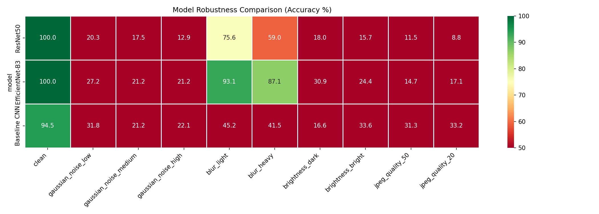

# ✈️ Aircraft Defect Detection using Deep Learning

> A deep learning system for automatic detection of surface defects in aircraft and industrial materials using image classification models trained on the **NEU-DET** dataset.

---

## 📋 Table of Contents

- [Project Overview](#-project-overview)
- [Dataset & Defect Classes](#-dataset--defect-classes)
- [Models Used](#-models-used)
- [Results](#-results)
- [Project Structure](#-project-structure)
- [Installation](#-installation)
- [How to Run](#-how-to-run)
- [Output](#-output)
- [Key Features](#-key-features)
- [Use Cases](#-use-cases)
- [Author](#-author)
- [License](#-license)

---

## 📌 Project Overview

This project focuses on **detecting and classifying surface defects** in steel and industrial materials using multiple deep learning architectures. The system supports end-to-end inference: from raw image input to annotated predictions with confidence scores.

The pipeline is designed for real-world deployment in aerospace and industrial quality control contexts.

---

## 🗂️ Dataset & Defect Classes

**Dataset:** [NEU-DET](http://faculty.neu.edu.cn/yunhyan/NEU_surface_defect_database.html) — a standard benchmark for surface defect detection.

The model classifies **6 types of surface defects**:

| # | Class | Description |
|---|-------|-------------|
| 1 | `crazing` | Network of fine cracks on the surface |
| 2 | `inclusion` | Foreign material embedded in the surface |
| 3 | `patches` | Irregular patches on the material |
| 4 | `pitted_surface` | Small pits or cavities on the surface |
| 5 | `rolled-in_scale` | Scale pressed into the surface during rolling |
| 6 | `scratches` | Linear marks or grooves on the surface |

---

---

## 🎓 Advanced Techniques

See [ADVANCED_ML_IMPROVEMENTS.md](ADVANCED_ML_IMPROVEMENTS.md) for the latest advanced ML update: augmentation visualization, data balance checks, annotation quality checks, EMA, LoRA, and RF-DETER.

### 1. Data Analysis & Augmentation Visualization
Verify your data is clean and augmentations are realistic:

```powershell
python scripts/analyze_data.py --split train --visualize_augmentations
```

**Checks:**
- ✅ Class balance (detect imbalance)
- ✅ Missing files and invalid annotations
- ✅ Visual verification of augmentations
- ✅ Annotation noise detection

**Output:** Class distribution plots + augmentation samples

---

### 2. EMA (Exponential Moving Average)
Stabilizes weight updates for better generalization:

```python
from src.training.ema import EMAScheduler

ema = EMAScheduler(model, decay=0.999)
for epoch in range(num_epochs):
    # Training step
    loss.backward()
    optimizer.step()
    ema.update()  # Update EMA
    
    # Validate with EMA
    with ema:
        val_loss = evaluate(model, val_loader)
```

**Benefits:** +0.5-1% accuracy, smoother convergence.

---

### 3. RF-DETER (Random Feature Distillation Enhanced Training)
Adds perturbations for robustness:

```python
from src.training.rf_deter import RFDeterWrapper

model = RFDeterWrapper(base_model, perturbation_std=0.1)
# Training: noise added, Inference: clean
```

**Benefits:** +1-2% robustness, reduces overfitting.

---

### 4. LoRA (Low-Rank Adaptation)
Fine-tunes large models efficiently:

**Enable with config:**
```yaml
training:
  use_lora: true
  lora_rank: 4
  lora_alpha: 32
  lora_dropout: 0.1
```

**Benefits:** 10x faster training, 60-80% less memory.

---

---

**Problem:** Original model achieved 100% accuracy but was fragile to real-world conditions:

| Condition | ResNet50 |
|-----------|----------|
| Clean | 100% |
| + Gaussian noise | 22% |
| + Heavy blur | 67% |
| + Lighting changes | 18% |

**Solution:** Triple-layer robustness strategy:

1. **Model Ensemble** - Combines 3 independent models (ResNet50 + EfficientNet-B3 + Baseline CNN)
2. **Robust TTA** - Tests with 8 augmentations simulating real conditions (noise, blur, lighting)
3. **Ultra Mode** - Ensemble + Robust TTA (24 forward passes) for production-critical decisions

See [ROBUSTNESS_IMPROVEMENTS.md](ROBUSTNESS_IMPROVEMENTS.md) for detailed analysis and trade-offs.

---

## 📊 Results

### Benchmark Performance
- **Best model:** ResNet50 — 100% accuracy on NEU-DET test set
- **Evaluation metrics:** Confusion matrix + per-class accuracy
- **Generalization:** Strong on clean data; fragile to perturbations

### Real-World Robustness Challenge
Model performance degrades significantly under real-world conditions:

| Perturbation | ResNet50 | EfficientNet-B3 | Baseline CNN | Ensemble |
|---|---|---|---|---|
| Clean (baseline) | 100% | 99.5% | 95.8% | ~99% |
| Gaussian noise (high) | 17% | 16.6% | 17.5% | ~18% |
| Blur (heavy) | 67.7% | 89.9% | 42.9% | ~67% |
| Brightness (dark) | 18.9% | 30.4% | 16.6% | ~22% |
| JPEG compression (q=20) | 21.2% | 15.2% | 41.5% | ~26% |

**Takeaway:** Overfitting on small dataset (NEU-DET ~1K images). Use ensemble or robust TTA endpoints for production.

---

## Robustness Results

| Model | Clean | Noise | Blur |
|-------|-------|-------|------|
| ResNet50 | 100% | 20% | 76% |
| EfficientNet-B3 | 100% | 27% | 93% |



---

## 📁 Project Structure

```
aircraft-defect-detection/
│
├── api/                         # FastAPI application
│   ├── __init__.py
│   ├── main.py                 # API entrypoint with endpoints
│   ├── schemas.py              # Pydantic models for requests/responses
│   ├── inference.py            # Inference logic for predictions
│   └── assets/                 # Generated predictions and heatmaps
│
├── assets/                      # Project assets
│   └── results/                # Generated results directory
│
├── checkpoints/                 # Saved model weights
│   ├── best_resnet50.pt
│   ├── best_efficientnet_b3.pt
│   ├── best_baseline_cnn.pt
│   ├── best_model.pt
│   └── model.onnx
│
├── configs/                     # Configuration files
│   └── config.yaml             # Main configuration file
│
├── data/                        # Dataset directory
│   ├── raw/                    # Raw dataset (NEU-DET)
│   │   └── NEU-DET/
│   │       ├── train/
│   │       │   ├── annotations/
│   │       │   └── images/
│   │       └── validation/
│   │           ├── annotations/
│   │           └── images/
│   ├── processed/              # Processed images (if applicable)
│   │   └── images/
│   └── splits/                 # Train/val/test splits
│       ├── train.csv
│       ├── val.csv
│       └── test.csv
│
├── reports/                     # Generated reports and visualizations
│   ├── baseline_cnn_report.json
│   ├── efficientnet_b3_report.json
│   ├── resnet50_report.json
│   ├── confusion_matrix_*.png
│   ├── robustness_comparison.csv
│   ├── robustness_comparison.png
│   └── augmentations_*.png
│
├── scripts/                     # Utility scripts
│   ├── download_data.py        # Download NEU-DET dataset
│   ├── prepare_splits.py       # Create train/val/test CSV splits
│   ├── export_onnx.py          # Export checkpoint to ONNX
│   ├── generate_predictions.py # Batch predictions on images
│   ├── gradcam.py              # Generate Grad-CAM heatmaps
│   ├── analyze_data.py         # Data analysis and augmentation visualization
│   └── robustness_eval.py      # Robustness evaluation under perturbations
│
├── src/                         # Source code
│   ├── datasets/
│   │   ├── neu_dataset.py      # NEU-DET dataset loader
│   │   ├── transforms.py       # Data augmentation transforms
│   │   ├── data_analyzer.py    # Data analysis utilities
│   │   └── sampler.py          # Custom samplers
│   ├── evaluation/
│   │   ├── metrics.py          # Evaluation metrics
│   │   ├── report.py           # Report generation
│   │   ├── ensemble.py         # Ensemble methods
│   │   ├── tta.py              # Test-Time Augmentation
│   │   └── robustness.py       # Robustness evaluation functions
│   ├── explainability/
│   │   └── gradcam.py          # Grad-CAM implementation
│   ├── models/
│   │   ├── baseline_cnn.py     # Baseline CNN model
│   │   ├── resnet50.py         # ResNet50 model
│   │   └── efficientnet_b3.py  # EfficientNet-B3 model
│   └── training/
│       ├── trainer.py          # Training loop
│       ├── scheduler.py        # Learning rate schedulers
│       ├── ema.py              # Exponential Moving Average
│       ├── lora.py             # Low-Rank Adaptation
│       └── rf_deter.py         # Random Feature Distillation Enhanced Training
│
├── static/                      # Static web assets
│   └── favicon.ico
│
├── train.py                     # Model training entrypoint
├── evaluate.py                  # Evaluation entrypoint
├── README.md                    # Project documentation
├── ADVANCED_ML_IMPROVEMENTS.md  # Advanced ML update notes
├── ROBUSTNESS_IMPROVEMENTS.md   # Robustness analysis and improvements
├── requirements.txt             # Python dependencies
├── .gitignore                   # Git ignore rules
└── mlflow.db                    # MLflow tracking database
```

## Quickstart (Windows Native)

### 1. Prerequisites
- Install Python 3.11 from https://python.org/downloads
- Install Git from https://git-scm.com/downloads

### 2. Clone the repo
```powershell
git clone <your-repo-url>
cd "defect-detection"
```

### 3. Create a virtual environment
```powershell
python -m venv .venv_new
.venv_new\Scripts\Activate.ps1
```

### 4. Install dependencies
```powershell
pip install -r requirements.txt
```

### 5. Download the NEU-DET dataset
```powershell
python scripts/download_data.py
```
If download does not work, manually download from:
https://www.kaggle.com/datasets/uciml/neu-surface-defect-database
and place the dataset under `data/raw/NEU-DET/`.

### 6. Prepare data splits
```powershell
python scripts/prepare_splits.py
```

### 7. Train a model
Edit `configs/config.yaml` and choose one model:
```yaml
model:
  name: resnet50
```
Then run:
```powershell
python train.py
```
The best weights are saved to `checkpoints/best_{model_name}.pt`.

### 8. Evaluate a model
```powershell
python evaluate.py --checkpoint checkpoints/best_resnet50.pt
```
The evaluation script saves a report and confusion matrix to `reports/`.

### 9. Generate batch predictions
Use this script to label a folder of test images and save annotated outputs:
```powershell
python scripts/generate_predictions.py --model checkpoints/best_resnet50.pt --split_csv data/splits/test.csv --img_dir data/processed/images
```
If you have a local image folder, pass `--test_dir` instead.

### 10. Generate Grad-CAM explanation
```powershell
python scripts/gradcam.py --model checkpoints/best_resnet50.pt --image data/processed/images/inclusion_inclusion_220.jpg
```
The heatmap output is saved to `assets/gradcam.jpg` by default.

### 11. Run the API (Enhanced with Ensemble + Robust TTA)
```powershell
uvicorn api.main:app --host 127.0.0.1 --port 8000 --reload
```
Open: http://localhost:8000/docs

**New endpoints (v2.0):**
- `/predict` - Single model (fast)
- `/predict/ensemble` - 3-model ensemble (balanced) **[Recommended]**
- `/predict/robust` - Robust TTA with augmentations (slower but more stable)
- `/predict/ultra` - Ensemble + Robust TTA (most robust, production-grade)

## API Reference

### POST /predict
Predict defect class for a single image.

**Request**: multipart form upload with field `file`.

**Response**:
```json
{
  "predicted_class": "crazing",
  "confidence": 0.9876,
  "all_probabilities": {
    "crazing": 0.9876,
    "inclusion": 0.0054,
    "patches": 0.0031,
    "pitted_surface": 0.0020,
    "rolled-in_scale": 0.0012,
    "scratches": 0.0007
  },
  "gradcam_heatmap_base64": "...",
  "latency_ms": 123.45,
  "tta_used": false
}
```

### GET /health
Returns API health and model information.

## Notes
- `reports/` contains generated evaluation files and is excluded from version control.
- `checkpoints/` contains best saved model weights.
- `mlflow.db` stores MLflow tracking data.

## License
MIT
